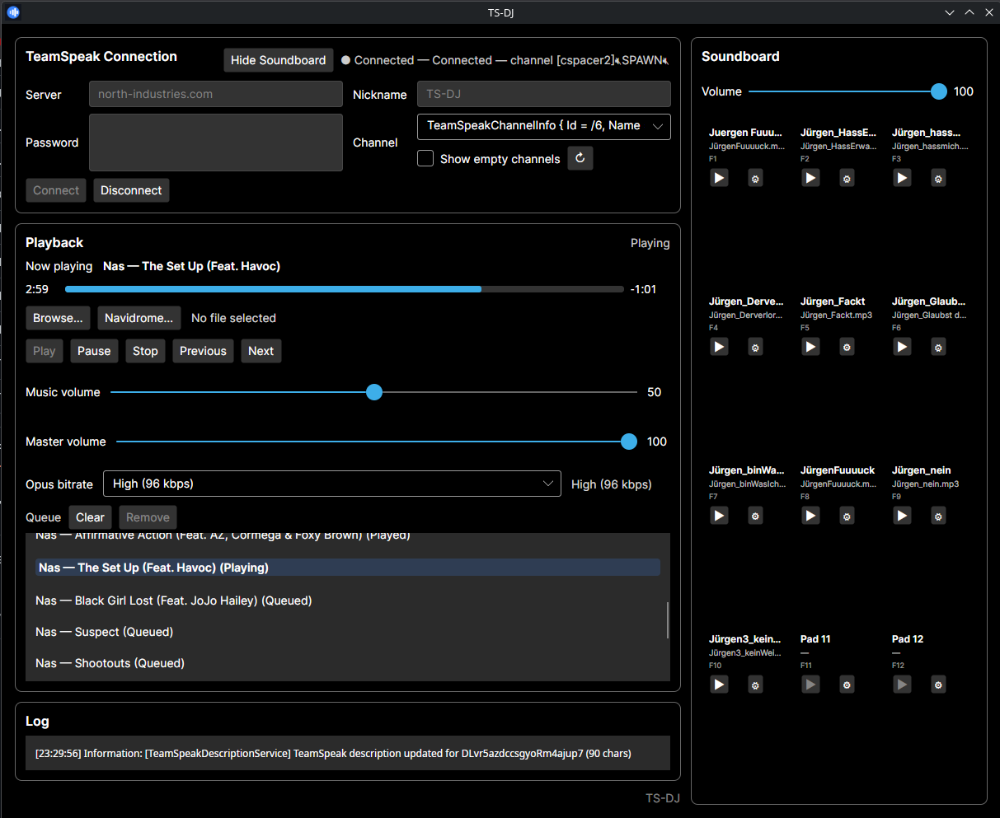
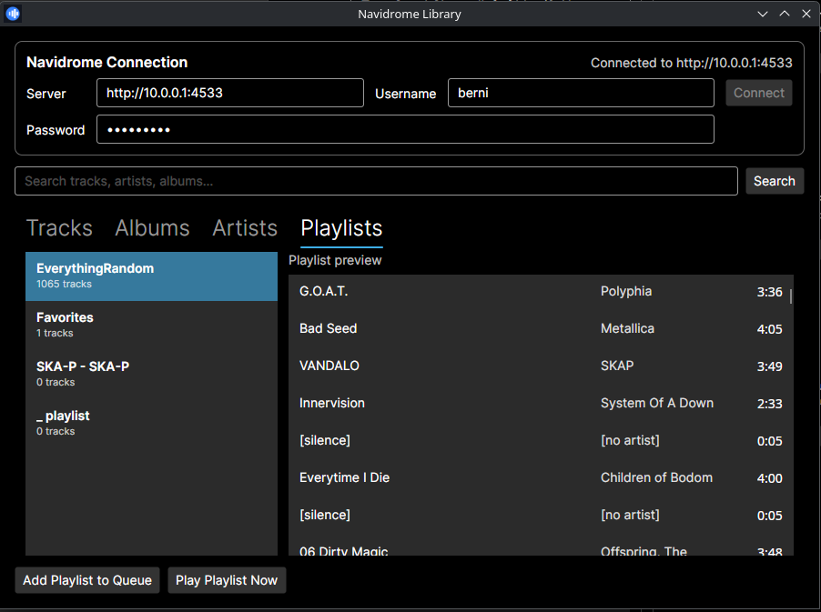
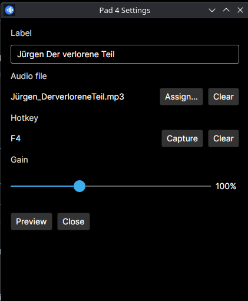

# TS-DJ

TeamSpeak 3 DJ client — streams local audio files and Navidrome library tracks into a TeamSpeak channel using a headless TS3 client.

## Features

- **TeamSpeak 3 streaming** — connect as a bot, select a channel, encode voice as Opus
- **Playlist and queue** — enqueue tracks, skip, reorder, play now
- **Navidrome integration** — browse/search Subsonic-compatible libraries; queue albums, artists, playlists, or tracks
- **YouTube URLs** — paste a video link to resolve metadata, queue, play, and save in playlists via bundled yt-dlp
- **Soundboard** — 12 pads with per-pad audio, volume, and hotkeys
- **Metadata sync** — track title/artist updates on the TS client nickname or description where supported
- **Linux desktop integration** — user-local install script with `.desktop` entry, icons, and CLI wrapper

## Screenshots

### Main window

TeamSpeak connection, playback queue, and log panel.



### Navidrome browser

Browse and queue tracks from a Subsonic-compatible Navidrome server.



### Soundboard pad settings

Per-pad audio file, volume, and hotkey configuration.



## Requirements

| Platform | Runtime | Native deps |
|----------|---------|-------------|
| Linux x64 | [.NET 8 runtime](https://dotnet.microsoft.com/download/dotnet/8.0) | `libopus0` (`sudo apt install libopus0`) |
| Windows x64 | .NET 8 runtime | `libopus.dll` (bundled in release zip) |

Build from source requires the [.NET 8 SDK](https://dotnet.microsoft.com/download/dotnet/8.0).

## Downloads

Pre-built release zips are published on [GitHub Releases](https://github.com/scheissegalo/TS-DJ/releases):

- `TS-DJ-<version>-linux-x64.zip`
- `TS-DJ-<version>-win-x64.zip`

Artifacts are **framework-dependent** — install the .NET 8 runtime before running.

## Linux setup

**From release zip:**

```bash
unzip TS-DJ-*-linux-x64.zip
cd TS-DJ-*-linux-x64
./ts-dj
```

See `INSTALL-linux.txt` inside the zip for optional application-menu setup.

**From source (user-local menu install):**

```bash
chmod +x packaging/linux/install-desktop.sh
./packaging/linux/install-desktop.sh
```

This publishes to `~/.local/share/ts-dj`, installs `~/.local/bin/ts-dj`, and registers a menu entry. Requires .NET 8 runtime and `libopus0`.

## Windows setup

1. Install the .NET 8 runtime.
2. Extract `TS-DJ-*-win-x64.zip`.
3. Run `TS-DJ.App.exe`.

`libopus.dll` is included under `lib/x64/`. See `INSTALL-windows.txt` in the zip.

## TeamSpeak

Configure in the main window:

- **Server** — hostname or `host:port` (default port 9987)
- **Nickname** — visible client name
- **Password / channel** — server password and target channel path or name

Connection settings persist in SQLite:

- Linux: `~/.local/share/TS-DJ/settings.db`
- Windows: `%LOCALAPPDATA%\TS-DJ\settings.db`

## Navidrome

Open **Navidrome…** from the playback panel (requires an active TS connection). Enter your Navidrome server URL and credentials. The browser supports search across tracks, albums, artists, and playlists; selected items can be queued or played immediately.

Navidrome exposes a Subsonic-compatible API; any compatible server may work but Navidrome is the tested target.

## YouTube

Open **YouTube…** from the playback panel (requires an active TS connection). Paste a single video URL (`youtube.com/watch`, `youtu.be`, or `music.youtube.com`). TS-DJ resolves title, uploader, and duration via yt-dlp, then either adds the track to the queue or starts playback immediately.

Saved playlists store the canonical video URL and metadata — not temporary stream URLs. On playback, audio is re-resolved through yt-dlp.

**yt-dlp location** (checked in order):

1. Optional path in **Options → YouTube / yt-dlp**
2. Bundled binary under `tools/yt-dlp/` next to the application
3. `yt-dlp` on `PATH`

Linux release builds include the bundled yt-dlp binary. Windows builds use a configured path or PATH until a Windows binary is bundled.

Playback buffers MP3 in memory after yt-dlp extracts via a short-lived temp file (FFmpeg cannot transcode to stdout with the bundled yt-dlp workflow).

## Build from source

```bash
git clone https://github.com/scheissegalo/TS-DJ.git
cd TS-DJ
dotnet build TS-DJ.slnx
dotnet run --project TS-DJ.App
```

**Publish locally:**

```bash
dotnet publish TS-DJ.App/TS-DJ.App.csproj -c Release -r linux-x64 --self-contained false -o ./publish/linux-x64
```

Release assembly scripts: [`packaging/release/`](packaging/release/).

## CI

- **CI** (`.github/workflows/ci.yml`) — builds on push/PR for `linux-x64` and `win-x64`, runs the SQLite settings smoke test (`tools/VerifySettings`).
- **Release** (`.github/workflows/release.yml`) — triggered by tags `v*.*.*`; publishes platform zips and creates a GitHub Release.

Integration harnesses under `tools/` (TS server, audio fixtures) are manual only.

## Release process (maintainers)

1. Bump `<Version>` in [`Directory.Build.props`](Directory.Build.props) on the development branch (optional; tag overrides at publish time).
2. Merge to the default branch; confirm CI passes.
3. Tag and push:

```bash
git tag v0.3.0
git push origin v0.3.0
```

4. The release workflow uploads `TS-DJ-<version>-linux-x64.zip` and `TS-DJ-<version>-win-x64.zip` to GitHub Releases.

See [`CHANGELOG.md`](CHANGELOG.md) for version history.

## Solution structure

| Project | Purpose |
|---------|---------|
| `TS-DJ.App` | Avalonia UI (MVVM) |
| `TS-DJ.Core` | Models, interfaces, shared constants |
| `TS-DJ.Infrastructure` | Logging, SQLite settings |
| `TS-DJ.Audio` | Audio pipeline (NAudio + TSLib pipes) |
| `TS-DJ.TeamSpeak` | TS3 connection wrapper |
| `TSLib` | TeamSpeak 3 protocol library (from [TS3AudioBot](https://github.com/Splamy/TS3AudioBot), targets net6.0) |

## Audio pipeline

```
Audio source → NAudio decoder → mixer/queue → VolumePipe → Opus encoder → TeamSpeak voice
```

Local files (MP3, FLAC, etc.), Navidrome HTTP streams, and YouTube URLs (via yt-dlp MP3 stdout) feed the same queue and encoder path.

### Media sources

| Source | Identity in queue | Playback resolution |
|--------|-------------------|---------------------|
| Local file | File path | Direct file decode |
| Navidrome | Subsonic track ID | Fresh authenticated stream URL at play time |
| YouTube | Canonical video URL | yt-dlp metadata at paste; MP3 audio buffered in memory at play time |

Browser extensions or a local HTTP API can reuse `YoutubeMediaQueueService` / `IMediaSource` without new playback code.

## License

- **TSLib** and adapted components from TS3AudioBot are licensed under [OSL-3.0](LICENSE).
- See [LICENSE](LICENSE) for full terms.

TSLib originates from the [TS3AudioBot](https://github.com/Splamy/TS3AudioBot) project by Splamy and contributors.
